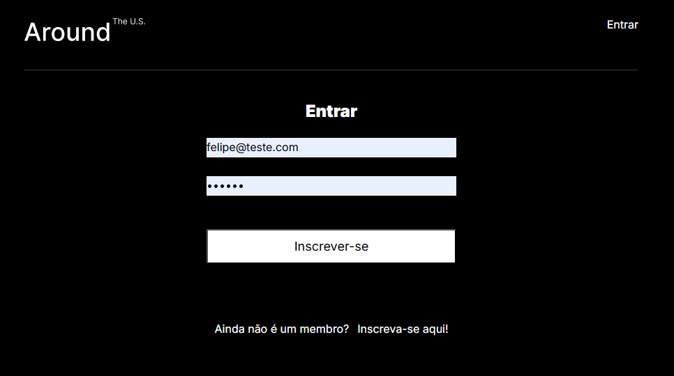
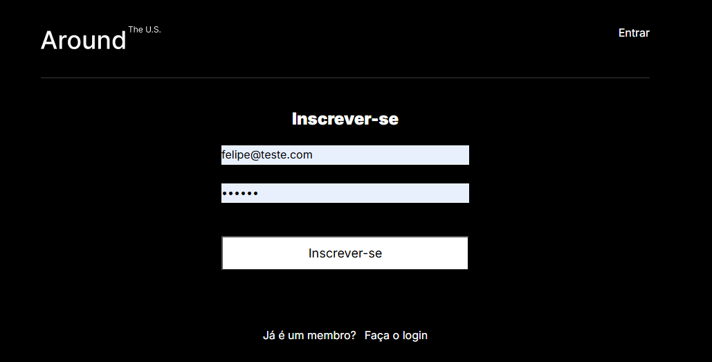
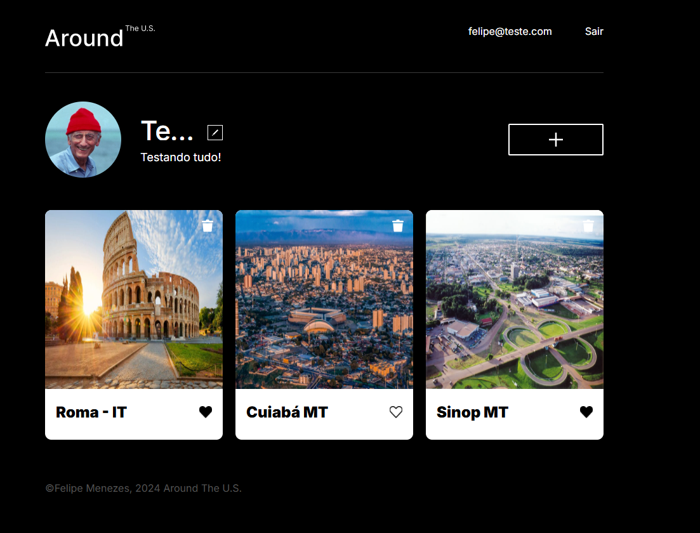
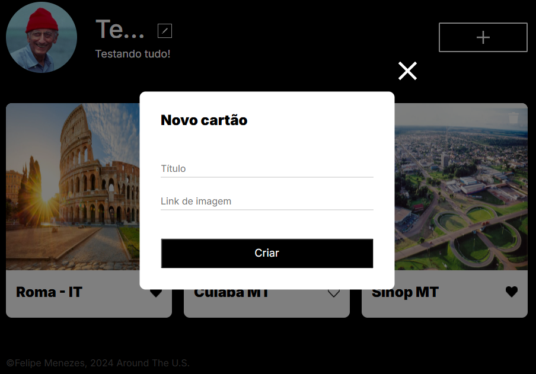

🃏 Web Project Fullstack – React + Node.js + MongoDB
🌟 Descrição

Projeto web fullstack com frontend em React + Vite e backend em Node.js/Express, consumindo uma API RESTful integrada ao MongoDB.

🔑 Funcionalidades principais:

Cadastro/login de usuários com JWT

CRUD de cards (criar, visualizar, curtir/descurtir, excluir)

Atualização de perfil e avatar

Popups interativos para cards e edição de perfil

Estado reativo no frontend (adicionar, deletar, curtir sem recarregar a página)

👉 Acesse em produção: https://www.aroundus-project.mooo.com

🖥 Tecnologias

Frontend

React + Vite

JSX e CSS Modules

Context API

Fetch API + async/await

Backend

Node.js + Express

MongoDB + Mongoose

JWT para autenticação

Validator para validação de dados

⚡ Funcionalidades
Frontend

Adicionar novos cards no início da lista

Deletar apenas cards do usuário atual

Curtir e descurtir cards (sincronizado com backend)

Popups para visualização de imagem, edição de perfil e avatar

Backend – Endpoints principais

GET /users/me – dados do usuário atual

PATCH /users/me – atualizar perfil

PATCH /users/me/avatar – atualizar avatar

GET /cards – listar cards

POST /cards – criar card

DELETE /cards/:id – deletar card

PUT /cards/:id/likes – curtir

DELETE /cards/:id/likes – descurtir

🔒 Todos os endpoints protegidos com JWT
⚙️ Validação e tratamento de erros implementados

Banco de Dados – MongoDB

Collections:

users → name, about, avatar, email, password

cards → name, link, owner, likes, createdAt

Cada card pertence a um usuário (owner)
Likes são armazenados como arrays de user.\_id

🚀 Como rodar localmente
Backend
cd backend
npm install # instala dependências
npm run dev # inicia servidor com nodemon
npm start # inicia em produção

Frontend
cd frontend
npm install # instala dependências
npm run dev # inicia Vite na porta 5173
npm run build # build de produção

Frontend disponível em: http://localhost:5173

🔧 Configuração

No backend:

MONGO_URI → conexão com banco de dados

JWT_SECRET → chave para autenticação

CORS habilitado para permitir requisições do frontend

📸 Prints da Aplicação

Login

Register

Tela principal

Adicionar cartões

💡 Observações

- Usuários só podem deletar seus próprios cards

- Likes/deslikes atualizam em tempo real no frontend
